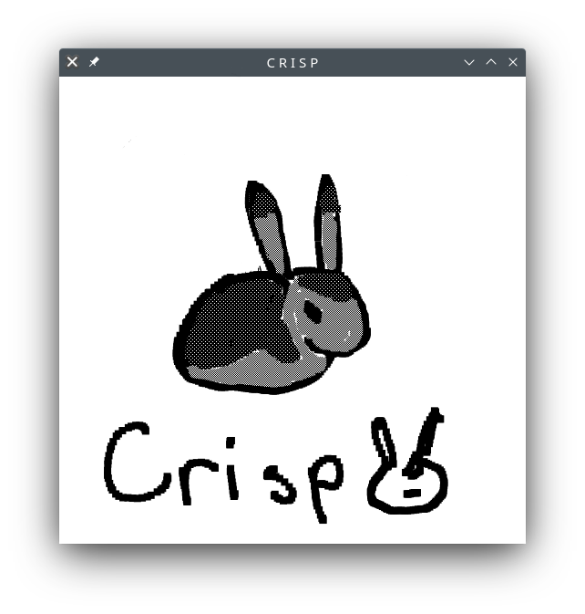

# Crisp

Crips is a minimalist painting program built using Rust and GTK.

## Controls

| Button |       Action      |
| :-:    | :---------------: |
| 1 - 8  | change brush      |
| 9      | eraser            |
| shift  | toggle brush size |
